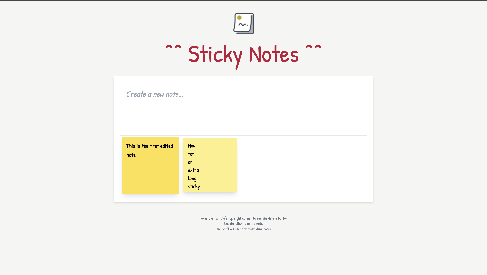

# Sticky Notes App

A simple, interactive sticky notes board built with Vite, JavaScript, and Tailwind CSS. Users can create, edit, and delete sticky notes in a clean, responsive interface.

## Live Demo: [Sticky Notes App](https://ldicker6.github.io/sticky-notes-app/)
---
## Features

- Create new sticky notes instantly by typing and pressing Enter
- Delete notes with a hover-activated trash button
- Double-click notes to edit them in place
- Save edits with Enter, Shift+Enter for multi-line, or Escape to cancel
- Notes animate on hover and stack responsively on the wall
- Fully responsive layout
---

## Tech Stack

### Vite
 – development/build tool

### Tailwind CSS
 – styling & layout

### Vanilla JavaScript – app logic

---

## 📸 Screenshots

**Home / Add Notes**  


**Editing a Note**  


**Deleting a Note**  


**Long Notes**  


---

## Local Development

To run the app locally:

# Clone this repository
```bash
git clone https://github.com/YOUR-USERNAME/sticky-notes-app.git
cd sticky-notes-app
```
# Install dependencies
```bash
pnpm install
```
# Start local dev server
```bash
pnpm dev
```
# Preview build
```bash
pnpm preview
```
---
## Future Improvements

- Customizable note colors & sizes
- Pin important notes to the top
- Drag-and-drop note rearrangement
